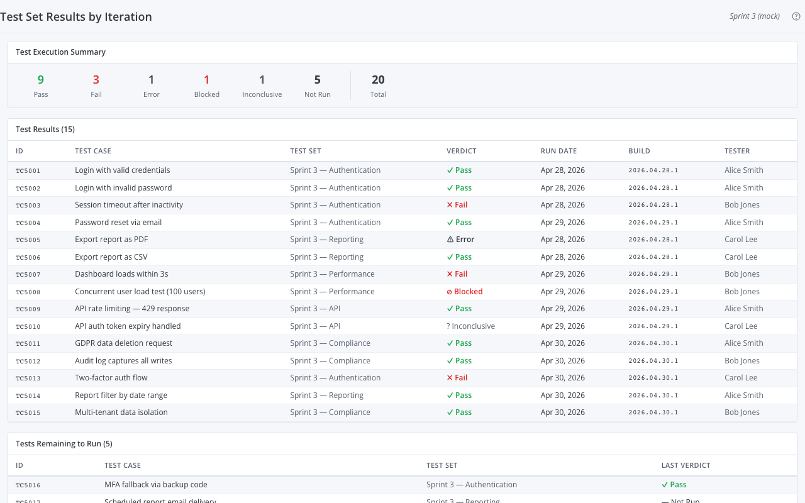

# Test Set Results by Iteration

A Rally Custom View widget that shows test execution results for a selected iteration in three sections: **Test Execution Summary**, **Test Results**, and **Tests Remaining to Run**.



Ported from [Broadcom's endorsed Rally widget](https://github.com/Broadcom/rally-widgets/tree/main/endorsed-widgets/test-set-results-by-iteration).

---

## What it shows

### Test Execution Summary

Counts of test cases grouped by their verdict in the selected iteration:
Pass, Fail, Error, Blocked, Inconclusive, and Not Run.

### Test Results

Table of all TestCaseResult records from the iteration's TestSets — verdict,
run date, build identifier, and tester for each run.

### Tests Remaining to Run

List of TestCases that belong to the iteration's TestSets but have not yet
been executed. Shows each test's last overall verdict so teams can prioritize
which tests to run next.

---

## Scope

- Current project only — no parent/child project scoping
- Iteration selected via the IterationPicker in the widget header
- All TestSets scheduled to the selected iteration are included

## Differences from the legacy App Catalog equivalent

- No Print Summary button
- No pagination toolbars — all results shown at once
- All TestSets within project/iteration scope are shown, regardless of whether TestCaseResults exist

---

## Setup

For end-to-end setup — Rally API key, auth configuration, dev harness, and deployment — see **[docs/setup-guide.md](docs/setup-guide.md)**.

Quick start once auth is configured:

```bash
npm install
npm run dev         # Dev server (mock data) at http://localhost:5173
npm run build       # Production IIFE bundle (live Rally data)
npm run build:mock  # Mock bundle (no Rally credentials needed)
npm run typecheck   # TypeScript check
```

---

## Settings

This widget has no configurable settings beyond iteration selection. Select the
iteration directly in the widget header using the iteration picker.

---

## Source

- `src/App.tsx` — Main widget component (three sections + EditMode panel)
- `src/types.ts` — `TestSetDataProvider`, data shapes, verdict types
- `src/data-provider.ts` — Live Rally WSAPI provider (TestSet + TestCaseResult queries)
- `src/mock-data.ts` — 15 mock results, 5 remaining, Sprint 3 scenario
- `src/main.tsx` — Entry point, mock/live branching

---

## Reference

- Broadcom spec: [endorsed-widgets/test-set-results-by-iteration](https://github.com/Broadcom/rally-widgets/tree/main/endorsed-widgets/test-set-results-by-iteration)
- Rally WSAPI docs: [Broadcom TechDocs](https://techdocs.broadcom.com/us/en/ca-enterprise-software/valueops/rally/rally-help/reference/rally-web-services-api.html)
- Rally artifact types: `testset`, `testcaseresult`, `testcase`
